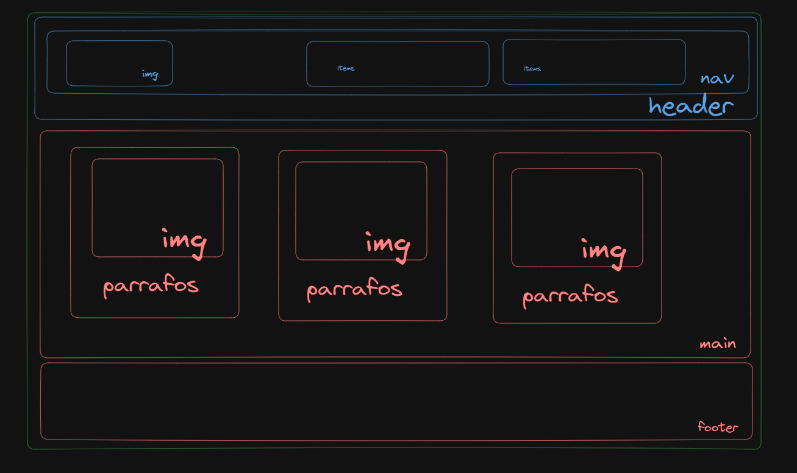

## HTML

## Hiper Text Markup Language

# Cada elemento en el lenguaje HTML produce un componente visual en el navegador

# estructura basica de un documento HTML

# Configuración

Donde esta la Configuración de la pagina:

```
<head>
    <meta charset="UTF-8" />
    <meta name="viewport" content="width=device-width, initial-scale=1.0" />
    <title>MarvelApp</title>
</head>
```

meta charset="utf-8"
permite definir propiedades que no pueden definirse en otras etiquetas
utf-8 estandar unicode para permitir la correcta visualizacion de los caracteres

title: En esta etiqueta vamos a poner el titulo de nuestra pagina. El mismo aparecera en la pestaña del navegador

# Body

```
<body>
    <h1>Pagina</h1>
</body>
```

## Etiquetas mas utilizadas:

# Etiquetas de texto:

```
    <h1>Pagina</h1>
    <p>Parrafo</p>
```

# Etiquetas de imagen:

```
descripcion de la pagina</a>
```

## Etiquetas semanticas

Nos van a ayudar a organizar nuestro sitio web:
Por ejemplo si tenemos esta estructura:



vamos a tener una estructura semantica como la siguiente:

```
 <body>
    <header>
      <nav>
        
        <ul>
          <li>item</li>
          <li>item</li>
        </ul>
        <ul>
          <li>item</li>
          <li>item</li>
          <li>item</li>
        </ul>
      </nav>
    </header>
    <main>
      <section>
        <h2>titulo</h2>
        <div>
          
          <p>alguna descripcion</p>
        </div>
      </section>
      <section>
        <h2>titulo</h2>
        <div>
          
          <p>alguna descripcion</p>
        </div>
      </section>
    </main>
    <footer>
      <h2>Footer</h2>
      <p>
        Lorem ipsum dolor sit amet consectetur adipisicing elit. Dolorem facere
        sequi, saepe, id laborum quae accusantium recusandae, culpa
        exercitationem deserunt sunt natus eligendi harum architecto eos fugit
        hic quaerat voluptates?
      </p>
      <p>Copyright 2023</p>
    </footer>
```

En la carpeta MarvelApp, esta la estructura que hicimos en clases!!
