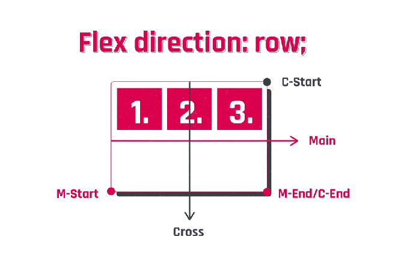
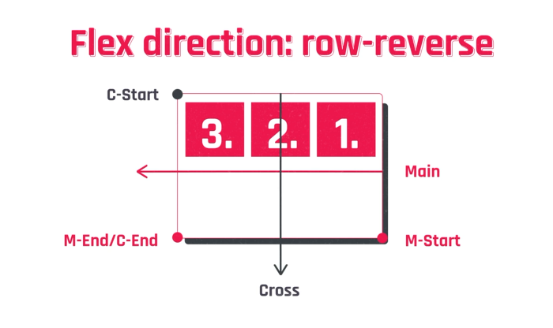
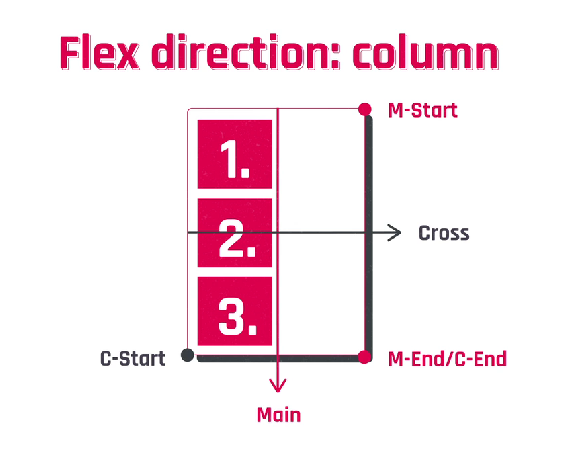
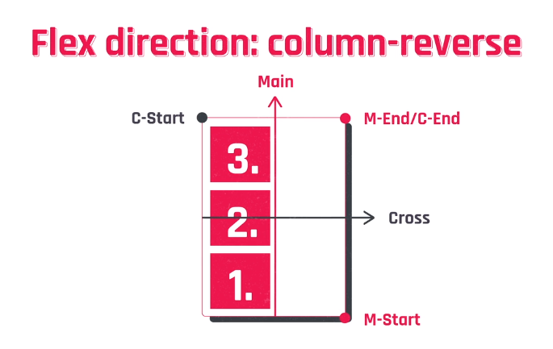

# Flexbox

## Ejes:

Los ejes dentro de un contenedor flex definen la orientación a partir de la cual se desplazarán los elementos internos del mismo.

Un contenedor flex posee dos ejes: el eje principal, llamado también main axis, y el eje transversal, llamado cross axis.

## Flex direction:

Con esta propiedad definimos el eje principal y el eje transversal.

**Row**

```
.contenedor {
    flex-direction: row; // por defecto esta será la propiedad de no definirla
}
```



**Row-reverse**

```
.contenedor {
    flex-direction: row-reverse;
}
```



**Column**

```
.contenedor {
    flex-direction: column;
}
```



**Column-reverse**

```
.contenedor {
    flex-direction: column-reverse;
}
```



> Flexbox nos da dos propiedades para alinear los elementos:
> a través del **Main Axis** con **justified-content**
> a través del **Cross Axis** con **align-items**

## Justified-content:

Con esta propiedad alineamos los items a lo largo del main axis.
Si es horizontal se alinearán en función de la fila,
Si es vertical en función a la columna

## Align Items:

Con esta propiedad alineamos los ítems a lo largo del cross axis. Si no aclaramos esta propiedad por defecto es stretch.

# Estructura basic de flexbox:

Flexbox propone una estructura basada en un contenedor padre (flex-container) y sus elementos hijos (flex-items)

# Propiedades de flexbox

```
.contenedor-padre {
    display: flex;
    flex-wrap: wrap; // respetar el ancho de los hijos - nowrap trataran de entrar todos en una misma linea

}
```

# Items

Flexbox nos da la posibilidad de aplicarle propiedades directamente a cada item para poder manipularlos por separado y tener mayor control

## Order:

Con esta propiedad podemos controlar el orden de cada item, sin importar el orden original que tenga en la estructura html.
Por defecto todos tienen la propiedad `order: 0`. Se ordenara de menor a mayor

```
.caja {
    order: 1;
}
```

## Flex-grow:

Definimos cuanto puede llegar a crecer un item en caso de disponer de espacio libre en el contenedor. El valor 1 equivale al 100% del espacio disponible y 0 al 0%. Podemos utilizar cualquier valor en medio como por ejemplo 0.25 para el 25%.

```
.caja {
    flex-grow: 1;
}
```

## Align self:

Nos pemite alinear sobre el cross axis, a cada item al que le apliquemos esta propiedad, independientemente de la alineación.
